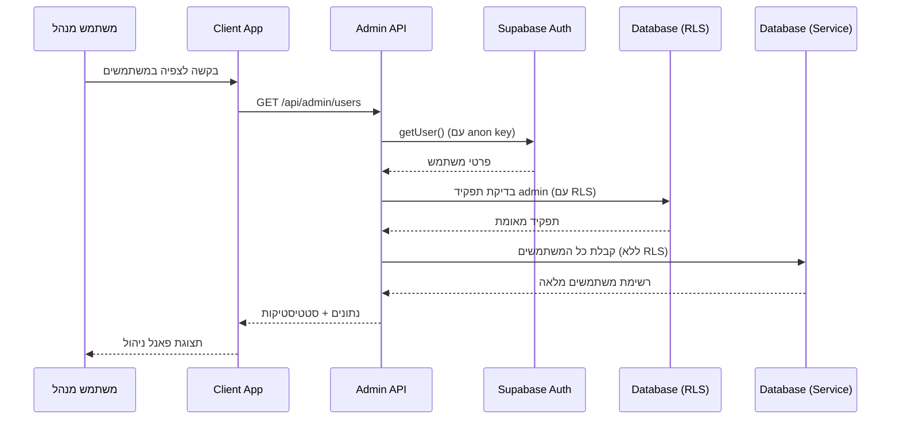

# מדריך הגדרת מנהל מערכת

## סקירה כללית

מדריך זה מסביר כיצד להגדיר נכון את מערכת הניהול ואת הגישה של המנהלים למערכת.

## הגדרת משתנה Service Key

### 1. קבלת Service Role Key מ-Supabase

1. היכנס ל-dashboard של Supabase בפרויקט שלך
2. לך ל-Settings > API
3. תחת "Project API Keys" תמצא את:
   - `anon public` - זה הקלוח הציבורי (כבר יש לך)
   - `service_role` - זה המפתח לפעולות ניהול

### 2. הוספת המפתח לסביבת הפיתוח

הוסף לקובץ `.env.local` שלך:

```env
# Supabase configuration
NEXT_PUBLIC_SUPABASE_URL=your-supabase-url
NEXT_PUBLIC_SUPABASE_ANON_KEY=your-supabase-anon-key
SUPABASE_SERVICE_ROLE_KEY=eyJhbGciOiJIUzI1NiIsInR5cCI6IkpXVCJ9...
```

⚠️ **אזהרת אבטחה**: Service Key מאפשר גישה מלאה למסד הנתונים ועוקף את כל מדיניות ה-RLS. לעולם אל תחשוף אותו בקוד client-side או תשלח אותו לדפדפן.

## ארכיטקטורת האבטחה

### עקרונות עיצוב

1. **הפרדה ברורה בין Client ו-Server**:
   - Client: משתמש ב-anon key + RLS policies
   - Server (Admin): משתמש ב-service key + מעקף RLS

2. **אימות כפול**:
   - תחילה אימות המשתמש עם anon client
   - בדיקת הרשאות admin
   - רק אז שימוש ב-service client לפעולות ניהול

3. **עקרון הרשאה מינימלית**:
   - רק משתמשים עם תפקיד 'admin' יכולים לגשת ל-API routes של הניהול

### זרימת האימות



## קבצי המערכת

### Password Management (`src/app/api/admin/create-user/route.ts`)

המערכת כוללת שתי פונקציות ליצירת סיסמאות:

```typescript
/**
 * יוצר סיסמה מאובטחת למבוגרים
 * @param length - אורך הסיסמה (ברירת מחדל: 12)
 * @returns סיסמה עם אותיות גדולות וקטנות, מספרים וסמלים
 */
function generateSecurePassword(length: number = 12): string {
  // מבטיח לפחות תו אחד מכל קטגוריה
  // ומערבב את התוצאה
}

/**
 * יוצר סיסמה פשוטה לילדים
 * @param username - שם המשתמש לבסיס הסיסמה
 * @returns סיסמה פשוטה בפורמט name + 2 ספרות
 */
function generateChildFriendlyPassword(username: string): string {
  const randomSuffix = Math.floor(Math.random() * 100).toString().padStart(2, '0');
  const cleanUsername = username.replace(/[^a-zA-Z0-9]/g, '').toLowerCase();
  return `${cleanUsername}${randomSuffix}`;
}
```

### Service Client (`src/utils/supabase/service-client.ts`)

```typescript
/**
 * יוצר Supabase client עם service role key עבור פעולות ניהול
 * Client זה עוקף מדיניות RLS
 * 
 * ⚠️ אזהרת אבטחה: רק לשימוש בקוד server-side
 */
export function getServiceSupabase() {
  // בדיקה שאנחנו בצד השרת
  if (typeof window !== 'undefined') {
    throw new Error('Service Supabase client cannot be used in the browser');
  }
  
  // יצירת singleton instance
  // ...
}
```

### Admin API Routes (`src/app/api/admin/users/route.ts`)

```typescript
export async function GET(request: NextRequest) {
  // 1. אימות המשתמש עם anon client
  const userSupabase = createServerClient(/* anon key */);
  const { data: { user } } = await userSupabase.auth.getUser();
  
  // 2. בדיקת הרשאות admin
  const { data: userRole } = await userSupabase
    .from('user_roles')
    .select('role')
    .eq('user_id', user.id)
    .single();
    
  if (userRole.role !== 'admin') {
    return NextResponse.json({ error: 'Admin access required' }, { status: 403 });
  }
  
  // 3. שימוש ב-service client לקבלת הנתונים
  const serviceSupabase = getServiceSupabase();
  const { data: profiles } = await serviceSupabase
    .from('profiles')
    .select('*'); // עוקף RLS - רואה הכל
}
```

## פעולות ניהול זמינות

### GET /api/admin/users
- **מטרה**: קבלת רשימת כל המשתמשים במערכת
- **הרשאות**: admin בלבד
- **החזרה**: רשימת משתמשים + סטטיסטיקות

### DELETE /api/admin/users?userId=xxx
- **מטרה**: מחיקת משתמש מהמערכת
- **הרשאות**: admin בלבד
- **הגבלות**: לא ניתן למחוק מנהלים או את עצמך

### POST /api/admin/create-user
- **מטרה**: יצירת משתמש חדש
- **הרשאות**: admin בלבד
- **פרמטרים**: email, username, display_name, role, parent_email (אופציונלי)
- **החזרה**: מידע על המשתמש החדש + סיסמה שנוצרה

#### ניהול סיסמאות
המערכת יוצרת סיסמאות אוטומטיות לפי סוג המשתמש:
- **ילדים**: סיסמה פשוטה בפורמט `username + 2 ספרות` (כמו `amit23`)
- **מבוגרים**: סיסמה מאובטחת בת 12 תווים עם אותיות, מספרים וסמלים

הסיסמה מוצגת למנהל פעם אחת בלבד ועליו להעביר אותה למשתמש בצורה בטוחה.

### PUT /api/admin/users
- **מטרה**: עדכון פרטי משתמש קיים
- **הרשאות**: admin בלבד
- **פרמטרים**: user_id, email, username, display_name, role
- **הגבלות**: לא ניתן לערוך מנהלים או לשנות תפקיד למנהל

### POST /api/admin/create-admin
- **מטרה**: יצירת מנהל מערכת חדש
- **הרשאות**: admin בלבד + אישור סיסמה
- **פרמטרים**: email, display_name, username, admin_password
- **אבטחה**: נדרש אישור סיסמת המנהל הנוכחי
- **החזרה**: סיסמה מאובטחת בת 16 תווים

#### אבטחת יצירת מנהלים
- ✅ רק מנהל קיים יכול ליצור מנהל חדש
- ✅ נדרש אישור סיסמת המנהל הנוכחי
- ✅ סיסמה מאובטחת יוצרת אוטומטית (16 תווים)
- ✅ לוג אבטחה למעקב אחר יצירת מנהלים
- ✅ לא ניתן ליצור מנהל דרך API רגיל
- ✅ לא ניתן לשנות תפקיד למנהל דרך עריכה

## מדיניות RLS מומלצת

במקום policy זמנית שמאפשרת הכל, עדיף ליצור policy ספציפית לאדמינים:

```sql
-- מדיניות שמאפשרת לאדמינים לראות את כל הפרופילים
CREATE POLICY "Admins can view all profiles" ON public.profiles
FOR SELECT
TO authenticated
USING (
  EXISTS (
    SELECT 1 FROM public.user_roles 
    WHERE user_id = auth.uid() 
    AND role = 'admin'
  )
);

-- מדיניות שמאפשרת לאדמינים לנהל את כל הפרופילים
CREATE POLICY "Admins can manage all profiles" ON public.profiles
FOR ALL
TO authenticated
USING (
  EXISTS (
    SELECT 1 FROM public.user_roles 
    WHERE user_id = auth.uid() 
    AND role = 'admin'
  )
);
```

## בדיקת התקנה

### 1. בדיקת משתני סביבה

```bash
# בדוק שיש לך את כל המשתנים
echo $NEXT_PUBLIC_SUPABASE_URL
echo $NEXT_PUBLIC_SUPABASE_ANON_KEY  
echo $SUPABASE_SERVICE_ROLE_KEY
```

### 2. בדיקת גישה ל-API

```bash
# בדיקה שה-API עובד (אחרי התחברות כמנהל)
curl -X GET "http://localhost:3010/api/admin/users" \
  -H "Content-Type: application/json" \
  --cookie-jar cookies.txt
```

### 3. בדיקת הרשאות

1. התחבר כמשתמש admin
2. לך ל-`http://localhost:3010/admin`
3. לחץ על "הצג" ברשימת המשתמשים
4. וודא שאתה רואה את כל המשתמשים במערכת

## פתרון בעיות נפוצות

### "Service key missing" 
- בדוק שהוספת את `SUPABASE_SERVICE_ROLE_KEY` ל-.env.local
- וודא שהפעלת מחדש את השרת אחרי הוספת המשתנה

### "Cannot read properties of undefined"
- בדוק שה-service key נכון ותקין
- בדוק שיש לך גישה לפרויקט ב-Supabase

### "Admin access required"
- בדוק שהמשתמש שלך הוא admin בטבלת user_roles
- בדוק שהתחברת כמשתמש הנכון

### "RLS errors" למרות service key
- בדוק שאתה משתמש ב-getServiceSupabase() ולא ב-createClient() רגיל
- בדוק שה-API route רץ בצד השרת ולא בדפדפן

## אבטחה בפרודקשן

### מומלץ:
1. **סיבוב מפתחות**: החלף service keys בקביעות
2. **לוגים**: תעד את כל פעולות הניהול
3. **audit trail**: שמור מי עשה מה ומתי
4. **הגבלת IP**: הגבל גישה למנהלים מ-IP ספציפיים
5. **MFA**: הפעל אימות דו-שלבי למנהלים

### לא מומלץ:
1. ❌ חשיפת service key בקוד client
2. ❌ שמירת service key ב-git
3. ❌ שימוש ב-service key לפעולות שאינן admin
4. ❌ מתן הרשאות admin ללא צורך
5. ❌ עקיפת בדיקות הרשאות

## תמיכה

אם אתה נתקל בבעיות:
1. בדוק את הלוגים בדפדפן (F12 > Console)
2. בדוק את לוגי השרת
3. וודא שכל משתני הסביבה מוגדרים נכון
4. בדוק שהמשתמש שלך הוא admin במסד הנתונים